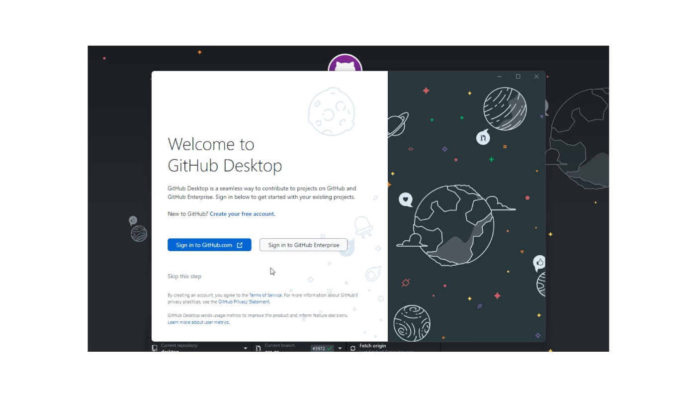
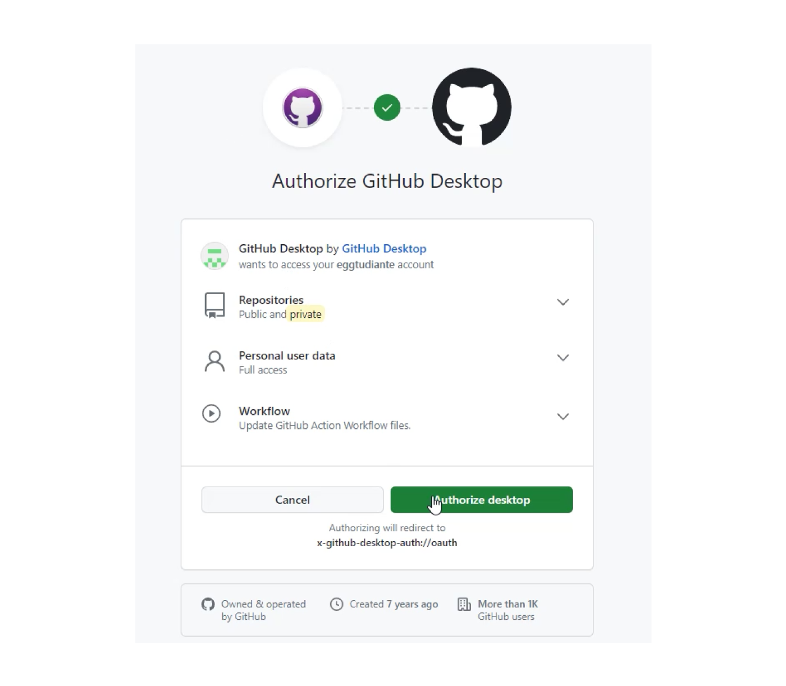
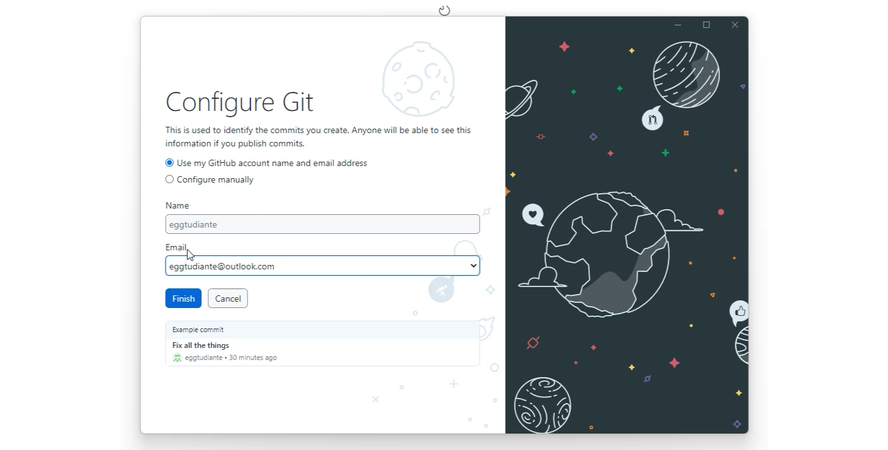
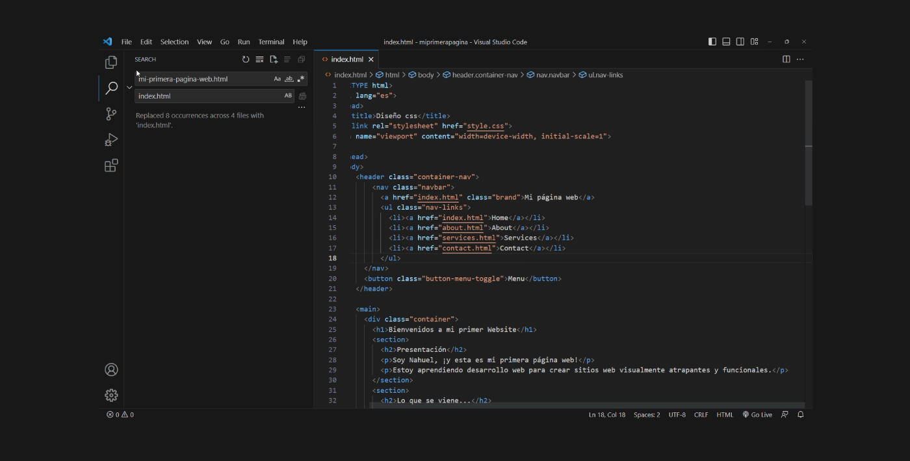
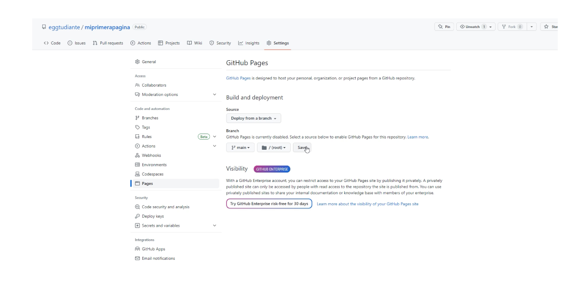
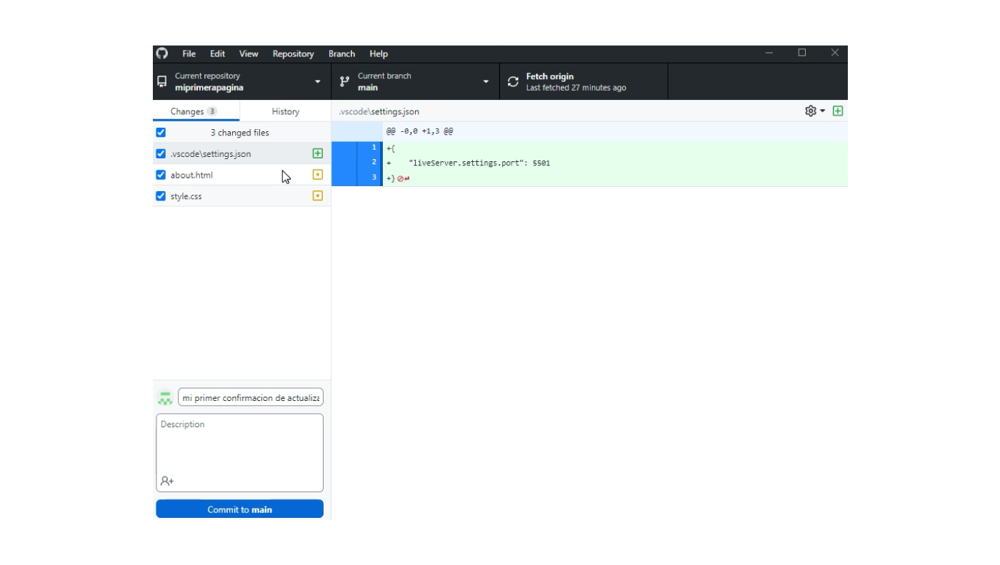
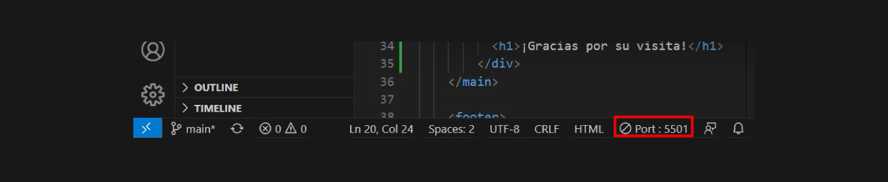
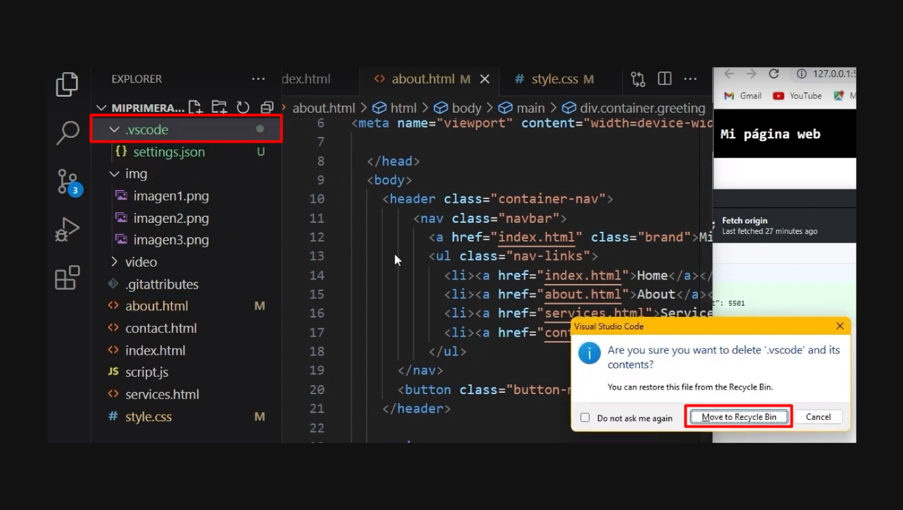
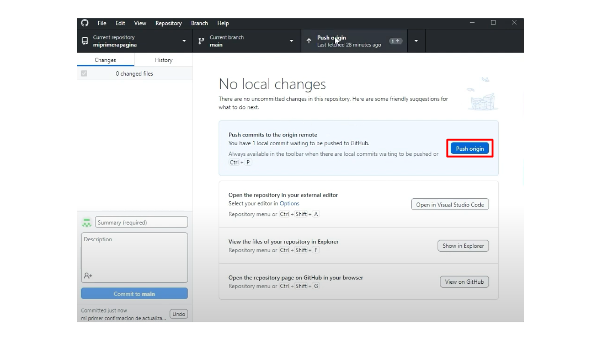
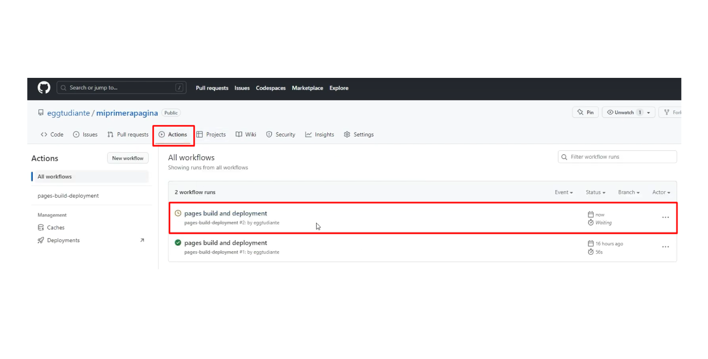

# clase_10
# 🏠 Paso 28 - ¡Cuenta en Github!

## 👋 ¡Bienvenido a tu siguiente paso! 
¡Hola! Seguimos avanzando 👟

En los pasos previos hemos visto cómo crear una web, darle estilos y hacerla interactiva con Javascript. 

Ahora veremos cómo publicar este sitio web en internet con la herramienta de Github. 

¿Listo? ¡Vamos! 🚀

# 📖 Material descargable
Aquí es donde encontrarás el material descargable que complementará los ejercicios prácticos que vamos a ver en los siguientes pasos. 

Para tu primer encuentro en vivo tienes que leer solo el material que te compartimos a continuación 👉 Introducción a Github
[documento](documento/10%20-%20Introducción%20a%20Github%20.pdf)
📢 ¡Importante!

No debes memorizar, concéntrate en entender el concepto. La práctica hará que luego puedas aplicarlo con más agilidad.

Si hay algo que no comprendes, ¡no te preocupes! Anótalo y pregunta a tus compañeros en el encuentro en vivo.

## ✍️ Para tu próximo encuentro en vivo
Github es la plataforma de desarrollo colaborativo que vamos a usar para compartir nuestra página al mundo.

Te pedimos que para tu próximo encuentro crees tu cuenta de Github.

¡Manos a la obra!

1. Ingresar a la página de Github a través del siguiente enlace 👉https://github.com/signup

2. Crear una cuenta ingresando: un correo electrónico, una contraseña y un nombre de usuario. 

3. Verificar la cuenta y hacer clic en el botón de “Create account”. Te enviarán un correo de confirmación.

4. Abrir el email de confirmación que llegó a tu cuenta de correo para copiar el número y pegarlo en la página de GitHub. 

¡Y listo! Luego de saltar la configuración de la cuenta, la misma ya estará creada y lista para funcionar.

Te compartimos el siguiente video donde te mostramos el paso a paso anteriormente detallado
https://youtu.be/CXIaaqqTlJQ
✅ Checklist
Asegúrate de:

*Leer la teoría

*Crear una cuenta en Github

💡 Revisar estos puntos es muy importante dado que ayudarán a que todos puedan tener la mejor experiencia posible y logren resolver los desafíos correspondientes.

# 👣 Paso 29 - ¡A trabajar en equipo!

## 👋 ¡Bienvenido a tu siguiente paso! 
Llegó el momento de publicar tu sitio web!

🛑✋ Momento, antes de continuar, validen: ¿crearon su cuenta de Github? Si no es así, tómense el tiempo de realizar este paso y sacarse las dudas porque ¡lo vamos a necesitar!. Si encuentran alguna dificultad, recuerden que pueden llamar al mentor para sacarse las dudas. 

¡Continuemos! 🚀

💡 Para este paso, les vamos a pedir que:

🔸Resuelvan individualmente el ejercicio en su propia computadora.

🔸Preguntar a tus compañeros en caso de no entender alguna parte. 

🔸Si no logran resolver algo entre todos, no olviden llamar al mentor para que los ayude. 

📌 ¡Recuerden mantener las cámaras encendidas en todo el proceso! ¡Sé protagonista de tus objetivos!

## ✏️ Actividad - Instalando Github Desktop

Para facilitar el uso de GitHub, existe una aplicación llamada GitHub Desktop. 

Esta aplicación te permite interactuar con GitHub utilizando una interfaz gráfica, lo cual significa que no necesitas escribir comandos complicados o usar un navegador web. En su lugar, puedes realizar acciones simplemente haciendo clic en botones y navegando a través de opciones visuales. 

Esto hace que sea más fácil para cualquier persona, incluso sin conocimientos técnicos previos, utilizar GitHub y aprovechar todas sus funciones.

¡Muy bien! Ahora sigue estos pasos para descargarla e instalarla en tu ordenador:

1. Descargar GitHub Desktop desde el siguiente enlace 👉https://desktop.github.com y hacer clic en el botón de descarga correspondiente a tu sistema operativo.

2. Hacer clic en el archivo descargado para comenzar la instalación.

3. Seleccionar "Sign in to GitHub.com" e introducir tu nombre de usuario y contraseña.( si no te aparece un form de login es porque ya estas logueado y puedes pasar al siguiente paso)

4. Hacer clic en el botón “Authorize desktop” para sincronizar la información.

5. Configurar tu cuenta eligiendo la opción "Use my GitHub account name and email address" y seleccionando la dirección de correo electrónico correspondiente.

6. Hacer clic en el botón “Finish” para completar la instalación.

¡Listo! 🙌 Una vez que hayas seguido estos pasos, ya podrás utilizar GitHub Desktop y aprovechar todas sus funciones.

Si quedaron dudas, en los siguientes videos te mostramos este paso a paso detallado en dos partes:
https://youtu.be/lN9yR--pto8?feature=shared
https://youtu.be/9Vrvwl7zgPY?feature=shared

## ✏️ Actividad - Subiendo la página web a Internet

Una vez que has desarrollado tu página web, es hora de compartirla en Internet. A continuación, aprenderás a subir tu página web utilizando GitHub Desktop. 

Simplemente sigue estos pasos:

❗IMPORTANTE: Antes de comenzar debes crear una nueva carpeta con el nombre de “miprimerapagina” y hacer una copia de los archivos sobre los que venías trabajando.

1. Abrir la carpeta de “miprimeraagina” en Visual Studio Code. 

2. Regresar a pestaña de GitHub Desktop y hacer clic en la opción “Add an Existing Repository from your hard drive”.

3. Buscar la carpeta de “miprimerapagina” y hacer clic en “Seleccionar carpeta”.

4. Hacer clic en el enlace de “create a repository” y luego en el botón de “Create repository”. 

5. Se creará el repositorio. Luego, dar clic en “Cancel”.

6. Destildar la opción de “keep this code private” para que el repositorio sea público, y posteriormente hacer clic en el botón de “Publish repository”. 

Ten en cuenta que este proceso puede durar unos segundos dependiendo del tamaño de tus archivos.

7. Publicado el repositorio, hacer clic en la opción de “View on GitHub”. Se abrirá en el navegador una pestaña con el repositorio.

Asegúrate de que esa pestaña se haya abierto en el navegador donde estás logueado/a en tu cuenta de Github. En caso de que no, copiar el link y pegarlo en el navegador en el cual venías trabajando.

8. Ingresar en la opción de “Settings” y, en la columna lateral, ir a la opción de “Pages”.

9. En la sección de Branch, cambiar la opción de “None” por “Main”, y hacer clic en “Save

Te aparecerá el mensaje de “Github Pages source saved”.

10. Finalmente, en la sección de Custom domain, podrás ver parte del dominio (URL) de tu repositorio. En este ejemplo, sería “eggtudiante.github.io”. 

Copiar ese dominio y llevarlo a una nueva pestaña del navegador agregándole el nombre de la carpeta, como por ejemplo: “eggtudiante.github.io/miprimerapagina”.

¡Listo! 🙌 Deberías poder ver tu página web pública en Internet.

💡De ver el error “404” no te preocupes ya que este proceso puede demorar algunos minutos. Te recomendamos esperar un ratito y luego refrescar la pestaña para ver impactados los cambios.

Una vez más, por si quedaron dudas, te compartimos el paso a paso detallado el siguiente video:
https://youtu.be/nAL0WfhU0z0

✅ Checklist
Asegúrate de:

Instalar Github Desktop

Subir tu página web

💡 Revisar estos puntos es muy importante dado que ayudarán a que todos puedan tener la mejor experiencia posible y logren resolver los desafíos correspondientes. 

# 👣 Paso 30 - ¡Actualizando tu página web!

## 👋 ¡Bienvenido a tu siguiente paso! 
🛑✋ Momento, antes de continuar, validen: ¿todos pudieronpublicar su sitio? Si no es así, tómense el tiempo de realizar este paso y sacarse las dudas porque ¡lo vamos a necesitar!. Si encuentran alguna dificultad, recuerden que pueden llamar al mentor para sacarse las dudas. 

¡Continuemos! 🚀

💡 Para este paso, les vamos a pedir que:

🔸Resuelvan individualmente el ejercicio en su propia computadora.

🔸Preguntar a tus compañeros en caso de no entender alguna parte. 

🔸Si no logran resolver algo entre todos, no olviden llamar al mentor para que los ayude. 

📌 ¡Recuerden mantener las cámaras encendidas en todo el proceso! ¡Sé protagonista de tus objetivos!

✏️ Actividad - Haciendo cambios en tu web
Mantener tu página web actualizada es esencial para mantener el interés de tus visitantes a lo largo del tiempo. 

A continuación, te mostramos paso a paso cómo hacerlo utilizando la plataforma de GitHub:

1. Ingresar a Visual Studio Code donde ya deberías ver abierta la carpeta de “miprimerapágina”. En caso de no verla, abrir nuevamente dicha carpeta.

2. Sobre el archivo de “index.html”, hacer clic derecho y seleccionar la opción de “Open with Live Server”. Se te abrirá en una pestaña del navegador el contenido del mismo.

3. Volver al archivo de “index.html” en Visual Code y, dentro de la etiqueta `<main>`, agregar una nueva etiqueta `
` con un texto que te parezca relevante. 

A la etiqueta `
` creada sumarle la siguiente clase: class=”greeting”. No te olvides de guardar los cambios.

4. Ingresar al archivo de “style.css” y agrega un estilo representativo para este nuevo elemento

💡 Paralelamente, podrás observar todas las modificaciones que vas realizando en la pestaña del repositorio de Github desktop:

5. Dentro de Visual Code, vamos a parar el servidor del “Liver Server” haciendo clic en la opción de “Port: (...)”

6. Y, luego, eliminar el archivo de “.vscode”.

 7. En la ventana de Github desktop, en la columna lateral izquierda donde dice “Summary (required)” colocar el texto de “mi primera confirmación de actualización”, y hacer clic en “Commit to main”.

 

 8. Ahora vamos a aplicar todo estos cambios haciendo un “push” en la plataforma de GitHub Desktop. Para ello, hacer clic en el botón de “Push origin”.

 

 9. En el navegador, ir a tu repositorio en la página de Github (como por ejemplo: “github.com/eggestudiante/miprimerapagina”) y verificar que los cambios se estén cargando. Para ello, ingresar en la pestaña de “Actions” del repositorio.

 

 ¡Excelente! 🙌 Vas a poder observar los cambios aplicados a tu página unos minutos después cuando finalice la carga de los mismos.

## ✏️ Actividad - Actividad Grupal
¡Muy bien! Ahora es el momento de compartir el link de tu página web con tus compañeros y que ellos puedan darte “feedback”, es decir, sugerencias constructivas o de mejora para que luego puedas aplicar esas “mejoras” en tu sitio. 

💡 Aprovecha la colaboración de tu equipo para dejar hoy tu proyecto terminado.

¡Manos a la obra!

La dinámica consiste en que cada miembro de la mesa de trabajo se turne para compartir su página web y recibir comentarios constructivos sobre posibles cambios y mejoras. Recuerda guardar y aplicar los cambios en GitHub de la misma manera que lo has hecho anteriormente.

* Les compartimos algunas preguntas disparadoras que pueden resultarles útiles para llevar a cabo esta actividad:

* ¿Está claro el propósito de nuestro sitio web para los visitantes en los primeros segundos de que ingresan al mismo?

* ¿El sitio web es completamente accesible y usable en diferentes navegadores y dispositivos?

* ¿Hemos probado nuestro sitio web en diferentes resoluciones de pantalla?

* ¿Están todos los enlaces funcionando correctamente y llevan a las páginas correctas?

* ¿Los textos están bien redactados y son claros?

* ¿Están actualizadas y son relevantes todas las imágenes y otros medios audiovisuales?

* ¿El diseño del sitio web se alinea con la “marca” y el mensaje que queremos transmitir?

* ¿Cómo podemos mejorar la jerarquía visual para guiar al usuario a través del contenido de la página?

* ¿La estética general del sitio es atractiva para nuestro público objetivo?

* ¿Los colores que hemos usado son atractivos y están en armonía? ¿Representan correctamente nuestra marca?

* ¿Las fuentes que hemos elegido son legibles y estéticamente agradables? 

* Una vez aplicados todos los cambios. Te invitamos entonces a compartirlo en tu cuenta de LinkedIn mencionando a @eggcooperation.

